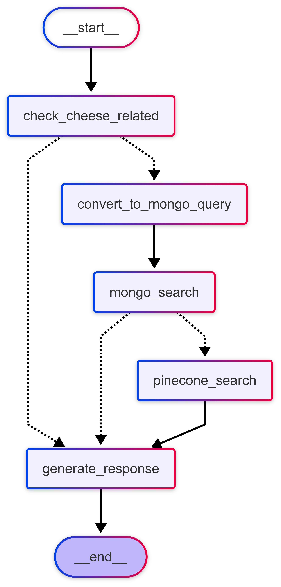

# 🧀 Cheese Chatbot Agent

A conversational AI agent for answering questions about cheese products, powered by LLMs, MongoDB, Pinecone vector search, and Streamlit.

## Features

- **Conversational Search**: Ask natural language questions about cheese products.
- **Hybrid Search**: Combines MongoDB (structured) and Pinecone (semantic vector) search for robust results.
- **LLM Reasoning**: Uses OpenAI's GPT models for query understanding, MongoDB query generation, and response synthesis.
- **Rich Product Data**: Supports detailed cheese product information, including brand, price, category, and more.
- **Transparent Reasoning**: View the agent's step-by-step reasoning process in the UI.

## Demo



## Getting Started

### 1. Clone the Repository

```bash
git clone <your-repo-url>
cd cheese-chatbot-agent
```

### 2. Install Dependencies

```bash
pip install -r requirements.txt
```

### 3. Prepare Environment Variables

Create a `.env` file in the project root with the following keys:

```
MONGO_URI=your_mongodb_connection_string
DB_NAME=your_db_name
COLLECTION_NAME=your_collection_name
PINECONE_API_KEY=your_pinecone_api_key
PINECONE_INDEX_NAME=your_pinecone_index_name
OPENAI_API_KEY=your_openai_api_key
```

### 4. Prepare Cheese Product Data

- Place your raw cheese product data in `data/cheese_raw.json` (array of product objects).
- **For Pinecone**: Run the Pinecone ingestion script to enrich and embed data:

  ```bash
  python ingestion/pinecone_ingest.py
  ```

- **For MongoDB**: Convert/enrich your data to `data/cheese_docs_monggo.jsonl` (one JSON per line), then run:

  ```bash
  python ingestion/monggo_ingest.py
  ```

### 5. Run the App

```bash
streamlit run streamlit_app.py
```

The app will be available at [http://localhost:8501](http://localhost:8501).

## Usage

- Ask questions like:
  - "Show me all sliced cheese under $10"
  - "Which cheeses are most popular?"
  - "How many brands of cheddar do you have?"
  - "Recommend a cheese for a party"
- The agent will display answers, product details, and its reasoning process.

## Project Structure

```
agent/
  langgraph_agent.py      # Main agent logic and workflow
  mongo_search.py         # MongoDB search logic
  pinecone_search.py      # Pinecone vector search logic
data/
  cheese_raw.json         # Raw cheese product data
  cheese_docs_monggo.jsonl # Enriched data for MongoDB
  cheese_docs_pinecone.jsonl # Enriched data for Pinecone
ingestion/
  monggo_ingest.py        # Script to ingest data into MongoDB
  pinecone_ingest.py      # Script to ingest data into Pinecone
streamlit_app.py          # Streamlit web app
requirements.txt          # Python dependencies
graph.png                 # Workflow diagram
```

## Dependencies

- Python 3.8+
- [Streamlit](https://streamlit.io/)
- [OpenAI Python SDK](https://github.com/openai/openai-python)
- [Pinecone](https://www.pinecone.io/)
- [PyMongo](https://pymongo.readthedocs.io/)
- [langgraph](https://github.com/langchain-ai/langgraph)
- [python-dotenv](https://github.com/theskumar/python-dotenv)
- [tqdm](https://tqdm.github.io/)

Install all dependencies with:

```bash
pip install -r requirements.txt
```

## Notes

- You need valid API keys for OpenAI and Pinecone, and access to a MongoDB instance.
- The ingestion scripts require your data in the expected format (see `data/cheese_raw.json` for an example).
- The app expects the Pinecone index and MongoDB collection to be pre-populated.

## License

MIT License
